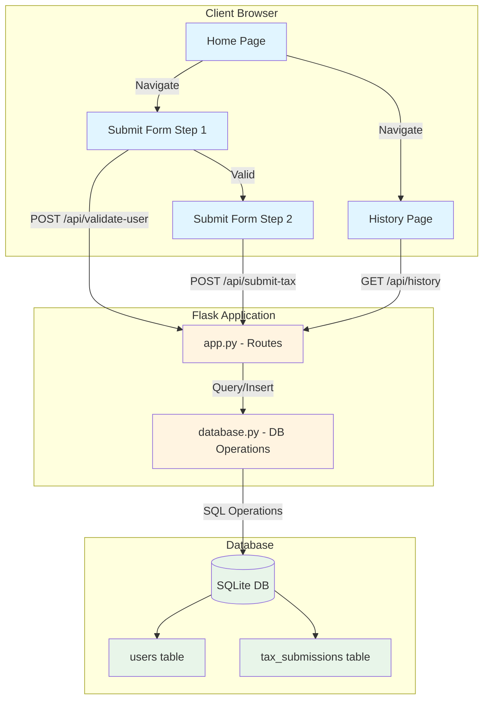
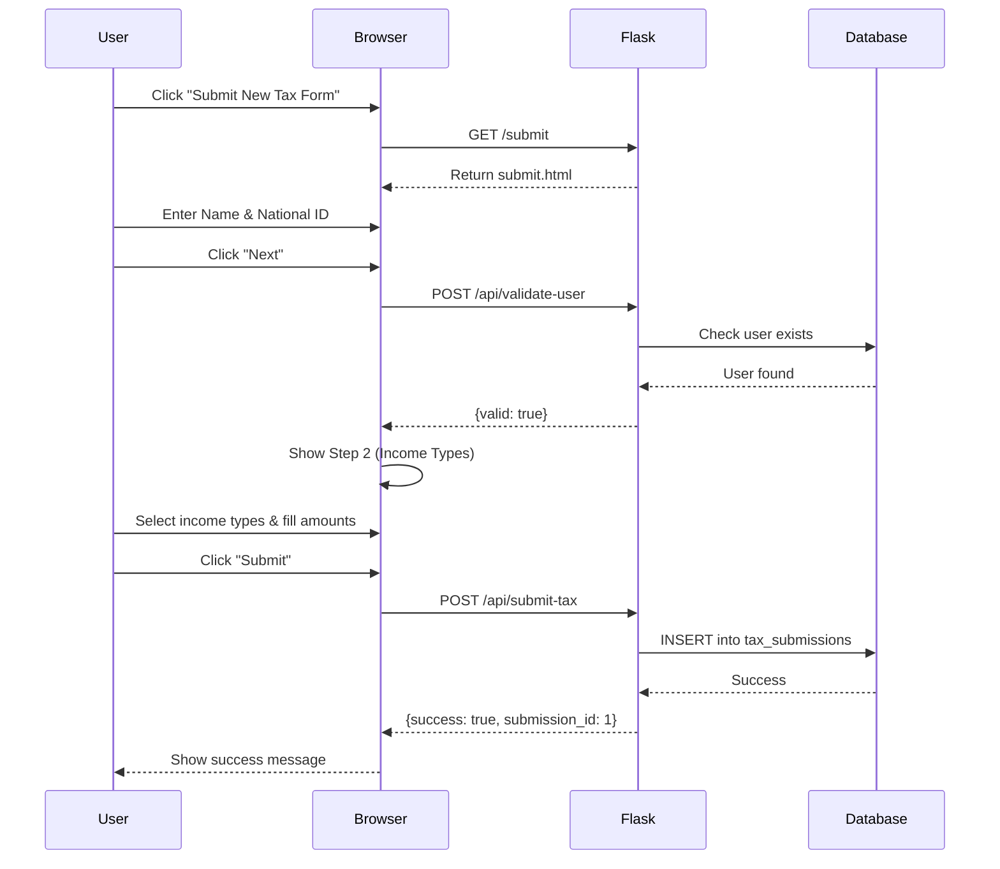
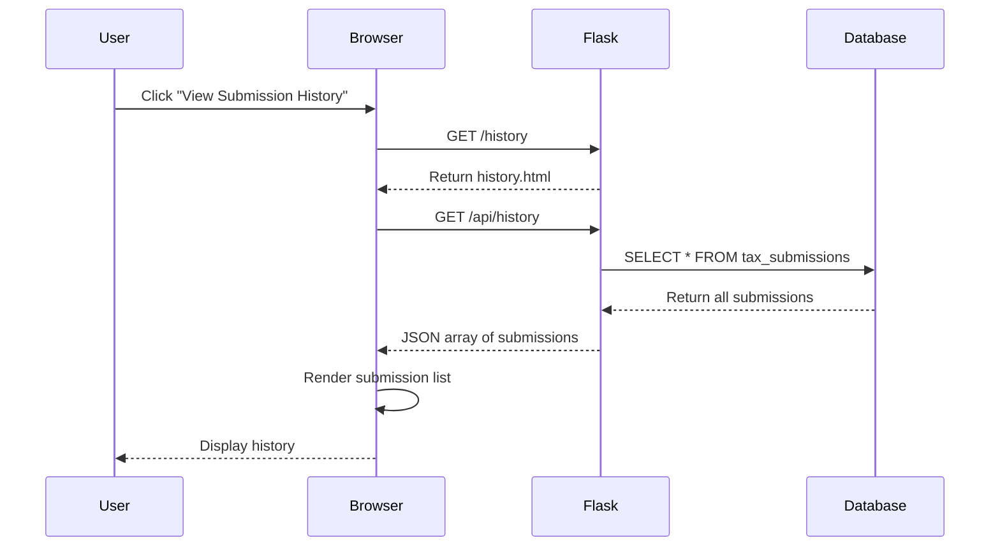
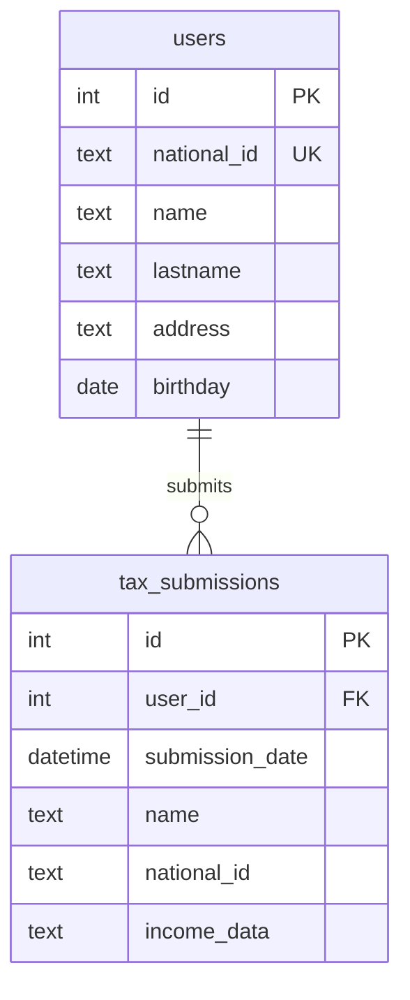

# Tax Submission Application - Architecture

## System Architecture Diagram



## Data Flow - Submit Tax Form



## Data Flow - View History



## Component Breakdown

### Frontend Components

1. **Home Page (home.html)**
   - Navigation buttons
   - Simple landing interface

2. **Submit Form (submit.html)**
   - Step 1: User validation form
   - Step 2: Income types selection (17 types from 5 categories)
   - Dynamic field visibility
   - Form validation

3. **History Page (history.html)**
   - List of all submissions
   - Expandable details view
   - Date formatting

### Backend Components

1. **Flask Routes (app.py)**
   - `/` - Home page
   - `/submit` - Submit form page
   - `/history` - History page
   - `/api/validate-user` - User validation endpoint
   - `/api/submit-tax` - Tax submission endpoint
   - `/api/history` - Get submissions endpoint

2. **Database Operations (database.py)**
   - `init_db()` - Create tables and seed data
   - `validate_user()` - Check user credentials
   - `submit_tax_form()` - Insert new submission
   - `get_all_submissions()` - Retrieve history

### Database Schema



## File Organization

```
tax-submission-app/
│
├── Backend (Python)
│   ├── app.py              # Flask routes and API endpoints
│   └── database.py         # Database initialization and operations
│
├── Frontend (HTML/CSS/JS)
│   ├── templates/          # Jinja2 HTML templates
│   │   ├── base.html       # Base template with common elements
│   │   ├── home.html       # Landing page
│   │   ├── submit.html     # Tax submission form
│   │   └── history.html    # Submission history
│   │
│   └── static/             # Static assets
│       ├── css/
│       │   └── style.css   # All styling
│       └── js/
│           ├── home.js     # Home page logic
│           ├── submit.js   # Form handling and validation
│           └── history.js  # History display logic
│
├── Database
│   └── tax_database.db     # SQLite database (auto-generated)
│
└── Configuration
    ├── requirements.txt    # Python dependencies
    ├── README.md          # Setup instructions
    ├── TECHNICAL_SPEC.md  # Technical specification
    └── ARCHITECTURE.md    # This file
```

## Technology Choices Rationale

1. **Flask**: Lightweight, easy to set up, perfect for local applications
2. **SQLite**: No server setup required, file-based, ideal for single-user local apps
3. **Vanilla JavaScript**: No build process, simple deployment, sufficient for this use case
4. **Jinja2 Templates**: Built into Flask, server-side rendering for simplicity

## Security Considerations

Since this is a local, single-user application:
- No authentication required
- No HTTPS needed (localhost only)
- No CORS issues
- No external API calls
- Data stored locally in SQLite file

## Performance Considerations

- Small dataset (single user, limited submissions)
- No pagination needed initially
- Simple queries (no complex joins)
- Local database (fast access)
- Minimal JavaScript (fast page loads)

## Future Enhancements (Out of Scope)

- Multi-user support with authentication
- PDF export of tax forms
- Tax calculation features
- Data backup/export functionality
- Mobile responsive design
- Form auto-save functionality